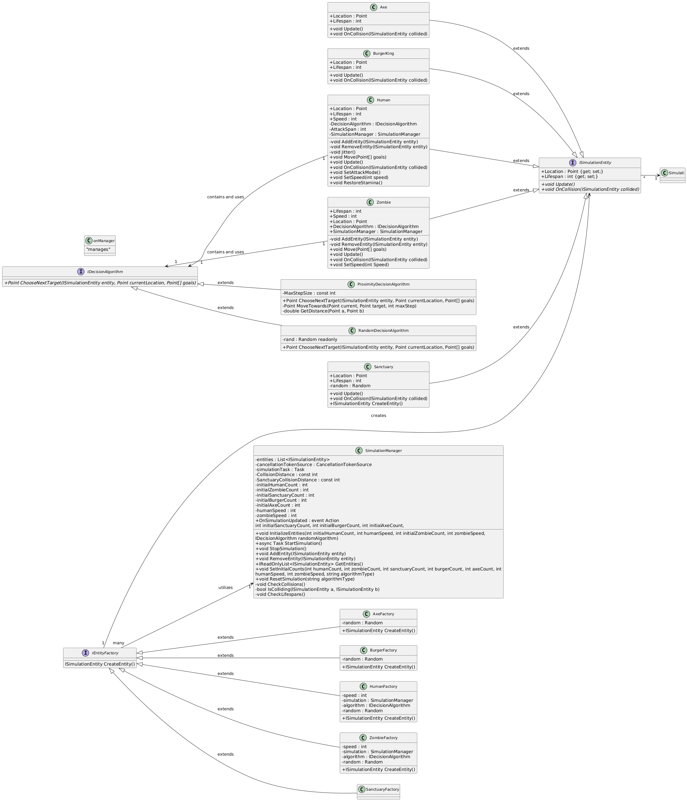

# Raiders vs Zombies Simulation Game

This project simulates an apocalyptic world where raiders (humans) fight for survival against zombies while gathering resources. It is built in C# as an exercise in Object-Oriented Programming (OOP) principles, leveraging multithreading, interfaces, and design patterns.

Developers:
- [Dampmar](https://github.com/Dampmar)
- [JenVicen](https://github.com/JenVicen)

## Table of Contents
- [Introduction](#introduction)
- [Gameplay](#gameplay)
- [Features](#features)
- [Installation](#installation)
- [Usage](#usage)
- [Code Structure](#code-structure)
- [Multithreading](#multithreading)
- [Design Patterns](#design-patterns)
- [License](#license)
- [Acknowledgments](#acknowledgments)

## Introduction

The project represents an automated survival simulation where:
- **Raiders** gather resources and escape zombies.
- **Zombies** chase and infect raiders.
- Safe zones (university sanctuaries) and supplies randomly spawn on the map.

The simulation emphasizes multithreading, collision detection, and decision-making algorithms to create an interactive environment.

## Gameplay

- Raiders and zombies spawn randomly on the map.
- Raiders seek supplies while avoiding zombies.
- Zombies attempt to infect raiders.
- University sanctuaries protect raiders temporarily but disappear after a set time.
- Entities move and interact based on decision-making algorithms.

## Features

- **Multithreading**: Each entity (raider, zombie, sanctuary) operates independently using threads.
- **Collision Handling**: Detects and resolves interactions between entities.
- **Decision Algorithms**:
  - Random movement.
  - Goal-oriented movement based on proximity (e.g., zombies chase nearest raider).
- **Simulation Configuration**:
  - Initial counts of raiders, zombies, and sanctuaries.
  - Entity speed ranges.
  - Lifespans for entities and sanctuaries.

## Installation

1. **Clone the Repository**:
   ```bash
   git clone https://github.com/Dampmar/ZombieSim.git
   ```

2. **Navigate to the Project Directory**:
   ```bash
   cd BlazorApp
   ```

3. **Open the Project in Visual Studio or your preferred C# IDE**.

4. **Build the Project** to restore any dependencies.

5. **Run the Project** to start the simulation.
    ```bash
    dotnet watch
    ```

## Usage

1. Run the Application via your IDE.
2. Configure simulation parameters (optional).
3. Observe the interaction between raiders, zombies, and sanctuaries in the simulation UI.

## Class Diagram
The project structure is encompassed by the following class diagram, where all components are labeled and their relationships stated.



## Code Structure

- **BlazorApp**: The main Blazor application.
- **Services**: Contains the simulation logic and entity management.
- **Models**: Defines the data structures for entities and the map.
- **Factories**: Create instances of entities.
- **Decision Algorithms**: Implement decision-making logic for entities.
- **UI**: The Blazor UI components.

## Multithreading
Each entity is managed on its own thread for independent behavior.

## Design Patterns
- MVC: Separates logic, data, and UI for modularity.
- Factory Pattern: Centralized creation of entities.
- SOLID Principles: Emphasis on maintainable and extensible code.

## License
This project is open-sourced under the MIT License - see the LICENSE file for details.

## Acknowledgments
- Inspired by the Texas Tech University Object-Oriented Programming course.
- Thanks to Dr. José Carranza-Rojas for guidance.
